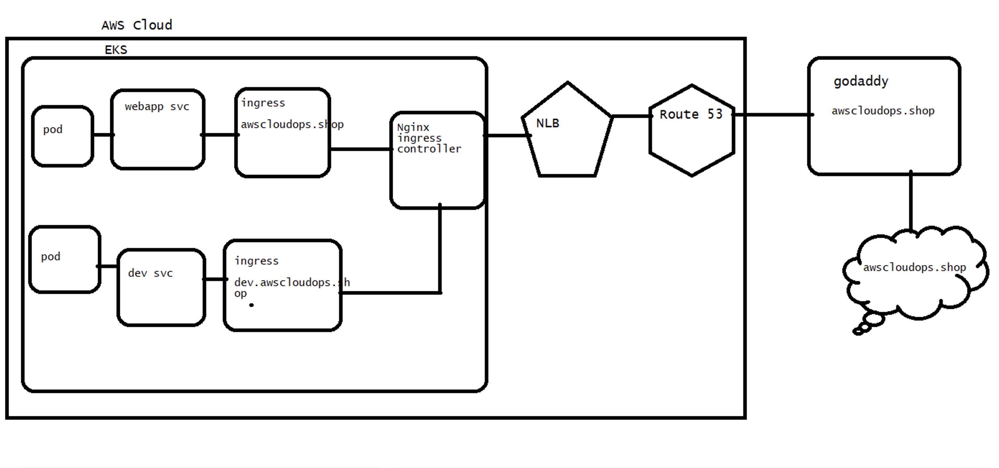

# Ingress and Ingress controller explainantion #

# Pre-requisites #
1. AWS EKS cluster
2. Route 53 Hosted Zone 
3. TLS/SSL certificate
4. Kubernetes manifest files

# Deploy Nginx ingress controller
```bash 
kubectl apply -f https://raw.githubusercontent.com/awsdevop183/kubernetes-ingress/main/nginx-ingress-controller.yml
```


# Create secret

``` kubectl create secret tls awscloudops  --cert=tls.crt --key=tls.key ```

# Generate SSL from Letsencrypt

```bash
certbot certonly --manual --preferred-challenges=dns --key-type rsa --email \
madhu@madhukarreddy.com \
--server https://acme-v02.api.letsencrypt.org/directory --agree-tos \
-d *.awscloudops.shop -d awscloudops.shop
```


